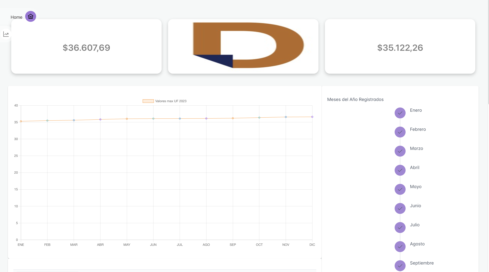

# datasurfrontend

# Tecnologias
- React
- styled-components
- react-router-dom
- otros
  - eslint
  - prettier
- prime react
- prime icons

la aplicacion es bastante simple, consta de dos interfaces 
- la primera donde se muestras 4 tarjetas y una barra de navegacion
interactiva

- ahora al pasar por encima de las tarjetas por medio de css se muestran los datos que 
guardamos en el modelo de django que exposimos por medio de un servicio y que consumimos en este momento

- esto mismo ocurre con todas las imagenes 
- el menu tambien tiene efectos donde al pasar por encima de algunas de las opciones se 
muestra lo siguiente 

- la opcion entra en el espacio de la pantalla desplegando su contenido

- la siguiente interfaz despliega la informacion de otro de los servicios que 
creamos en el backend

- esta interfaz es una tabla interactiva con filtros, paginacion , opciones de visualizacion de 
cantidad de objetos por pagina y ordenamiento de los mismos y un filtro global para buscar entre todos los datos de la 
tabla
  
- los valores se pueden sortear entre el mas alto y el menor y viceversa en cada 
una de las columnas
  